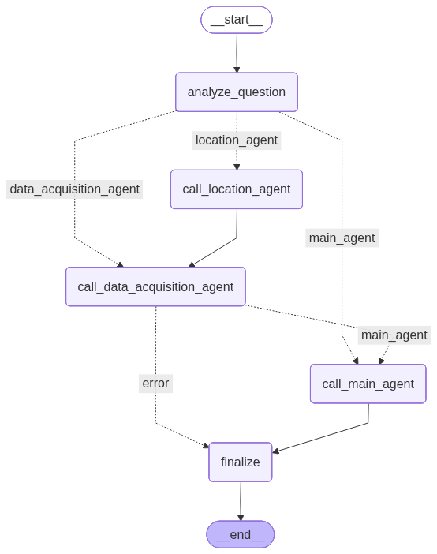

# Earth-Agent

Earth-Agent - мультиагентная система для анализа территорий по спутниковым данным. Пользователь задаёт вопрос на естественном языке, а система определяет локацию, подбирает спутниковые сцены, рассчитывает нужные показатели и возвращает интерпретируемый результат.

Проект ориентирован на задачи городского мониторинга: застройка, растительность, тепловые эффекты, водные объекты и пространственно-временные изменения городской среды.

## Архитектура

Система построена как конвейер специализированных агентов под управлением Supervisor.



## Агенты

| Агент | Роль |
|---|---|
| Analyze Question Agent | Разбирает запрос: локация, период, показатель, необходимость данных |
| Supervisor | Координирует этапы и передаёт контекст между агентами |
| Location Agent | Находит координаты и bounding box через OpenStreetMap |
| Data Acquisition Agent | Выбирает спутниковые сцены и скачивает нужные каналы |
| Main Agent | Рассчитывает индексы, статистики и формирует итоговый ответ |

Разделение ролей уменьшает смешение задач: геокодинг, получение данных и аналитика выполняются разными агентами.

## Инструменты

Earth-Agent использует MCP-инструменты для проверяемых действий:

| Группа | Назначение |
|---|---|
| EarthEngine | Поиск спутниковых сцен и скачивание GeoTIFF |
| OpenStreetMap | Геокодинг и работа с объектами карты |
| Index | Расчёт NDVI, NDBI, NDWI, NDTI и других индексов |
| Statistics | Средние значения, доли, разности, проценты |
| Inversion | Температурные и физические преобразования |
| Analysis | Тренды, временные ряды и изменения |

## Типовой сценарий

```text
Запрос пользователя
-> геокодинг объекта
-> поиск подходящих спутниковых сцен
-> скачивание каналов
-> расчёт индекса или физического показателя
-> статистическое сравнение
-> итоговый ответ
```

Примеры задач:

- оценить изменение растительности;
- сравнить долю застроенных территорий;
- определить тепловой контраст застройки;
- сравнить показатели водных объектов;
- найти год с максимальным или минимальным значением показателя.

## Работа с данными

Система учитывает период, сезон, облачность, разрешение, доступные каналы и физический смысл задачи.

Примеры соответствий:

| Задача | Данные |
|---|---|
| Растительность | Red + NIR |
| Застройка | SWIR + NIR |
| Температура поверхности | Тепловые каналы Landsat |
| Водные proxy-показатели | Видимые и ближние ИК-каналы по методике |

Выбор коллекции или канала не является ответом сам по себе. Это только основа для дальнейшего расчёта.

## Артефакты

Система сохраняет:

- журнал диалога агента;
- логи отдельных агентов;
- вызовы инструментов;
- скачанные GeoTIFF-файлы;
- производные растры;
- итоговые ответы.

Это позволяет понять, где возникла ошибка: в геокодинге, выборе сцены, скачивании данных, расчёте или интерпретации.